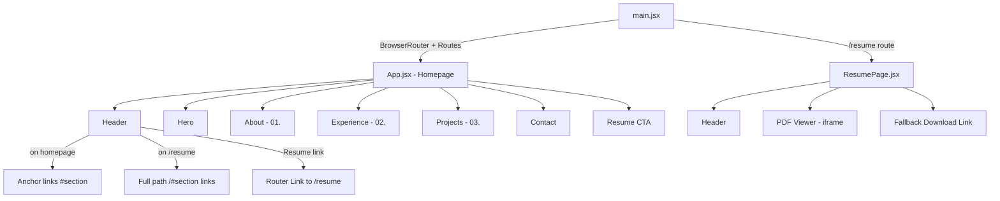
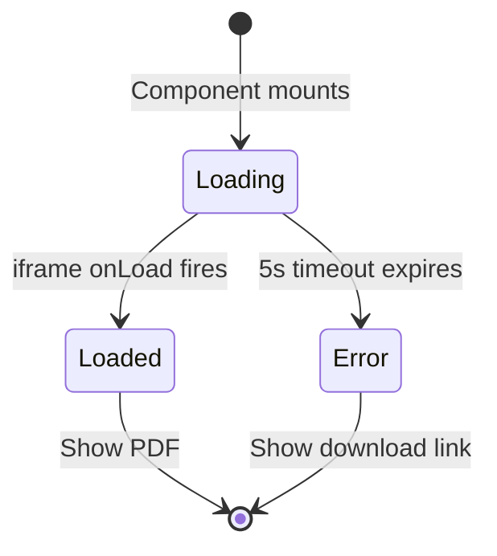

# Design Document: Work Experience and Resume Route

## Overview

This design adds a Work Experience section to the portfolio homepage and introduces client-side routing via `react-router-dom` to serve the resume PDF at a dedicated `/resume` route. The portfolio currently operates as a single-page app with no router. This feature introduces minimal routing (two routes), a new data-driven Experience component, a full-page PDF viewer page, and navigation updates to support cross-page linking.

**Key Design Decisions:**
- Use `BrowserRouter` with a `404.html` SPA fallback for gh-pages compatibility (cleaner URLs than HashRouter)
- Keep route definitions centralized in `main.jsx`
- Work experience data is co-located in the Experience component as a static array (no external data fetching)
- PDF viewer uses an `<iframe>` with a timeout-based fallback for browsers that don't support inline PDF rendering

## Architecture



**Routing Flow:**
- `/` → Homepage with all sections (Hero, About, Experience, Projects, Contact, Resume CTA)
- `/resume` → Full-page PDF viewer with back navigation
- `/*` (catch-all) → Redirect to `/`
- `public/404.html` → Script-based redirect to `index.html` for gh-pages direct URL access

## Components and Interfaces

### New Components

#### `Experience.jsx`
- **Purpose:** Renders the Work Experience section on the homepage
- **Props:** None (data is internal)
- **Renders:** Section with id="experience", section title "02. Experience", list of experience entries
- **Pattern:** Follows the same inline-style + CSS variable pattern as About.jsx and Projects.jsx

#### `ResumePage.jsx`
- **Purpose:** Full-page PDF viewer at `/resume`
- **Props:** None
- **State:** `loading` (boolean), `error` (boolean)
- **Renders:** Back-to-home link, loading indicator, iframe PDF viewer, fallback download link on error/timeout
- **Behavior:** Sets a 5-second timeout on mount. If the iframe `onLoad` fires, clears timeout and hides loader. If timeout expires, shows fallback download link.

#### `public/404.html`
- **Purpose:** gh-pages SPA fallback
- **Behavior:** Redirects all 404s to `index.html` preserving the path as a query parameter, which the SPA router can then resolve

### Modified Components

#### `main.jsx`
- **Changes:** Wrap App with `BrowserRouter`, define `<Routes>` with `/`, `/resume`, and catch-all `*` paths
- **Structure:**
  ```jsx
  <BrowserRouter>
    <Routes>
      <Route path="/" element={<App />} />
      <Route path="/resume" element={<ResumePage />} />
      <Route path="*" element={<Navigate to="/" replace />} />
    </Routes>
  </BrowserRouter>
  ```

#### `App.jsx`
- **Changes:** Add `<Experience />` component between About and Projects. Remove Header if it's rendered by each page independently, OR keep Header in App and use it in ResumePage separately.
- **Decision:** Header is rendered inside both App (homepage) and ResumePage independently, since nav link behavior differs based on current route.

#### `Header.jsx`
- **Changes:**
  - Add "Experience" and "Resume" to nav items
  - Use `useLocation()` from react-router-dom to detect current route
  - On homepage (`/`): section links use `#about`, `#experience`, `#projects`, `#contact`
  - On `/resume`: section links use `/#about`, `/#experience`, `/#projects`, `/#contact`
  - "Resume" link always uses `<Link to="/resume">`
  - Maintains existing styling (mono class, uppercase, 0.8rem, 0.1em letter-spacing)

#### `Resume.jsx`
- **Changes:** Replace `<a href={resumePdf} target="_blank">` with `<Link to="/resume">` from react-router-dom
- **Section number update:** Change "03." to "04." if Resume section remains, or remove if replaced by route

#### `Projects.jsx`
- **Changes:** Update section number from "02." to "03."

### Dependency Addition

- `react-router-dom` (production dependency, pinned version e.g. `^7.6.0` for React 19 compatibility)

## Data Models

### Experience Entry Structure

```typescript
interface ExperienceEntry {
  title: string;          // Job title (e.g., "AWS Cloud Engineer")
  dateRange: string;      // Employment period (e.g., "November 2025 - Present")
  company: string;        // Company name (e.g., "AfryScripta - WiNEST Research")
  location: string;       // Location (e.g., "Kigali, Rwanda")
  descriptions: string[]; // Bullet-point descriptions of responsibilities
}
```

### Static Data (hardcoded in Experience.jsx)

```javascript
const experiences = [
  {
    title: "AWS Cloud Engineer",
    dateRange: "November 2025 - Present",
    company: "AfryScripta - WiNEST Research",
    location: "Kigali, Rwanda",
    descriptions: [
      "Design and implement cloud infrastructure solutions on AWS",
      "Manage CI/CD pipelines and deployment automation",
      "Collaborate with research teams on cloud-native architectures"
    ]
  },
  {
    title: "Software Engineer",
    dateRange: "November 2024 - Present",
    company: "TMR International Hospital",
    location: "Uganda (Remote, Part-time)",
    descriptions: [
      "Develop and maintain telemedicine applications",
      "Implement RESTful APIs for secure health data exchange",
      "Manage cross-platform mobile application releases"
    ]
  }
];
```

### Resume Page State

```typescript
interface ResumePageState {
  loading: boolean;  // True while PDF iframe is loading
  error: boolean;    // True if timeout expires without iframe load
}
```

## Correctness Properties

*A property is a characteristic or behavior that should hold true across all valid executions of a system—essentially, a formal statement about what the system should do. Properties serve as the bridge between human-readable specifications and machine-verifiable correctness guarantees.*

After analyzing all acceptance criteria, most are UI rendering checks (example-based tests) or configuration/smoke tests. Only the catch-all route behavior has a meaningful input space suitable for property-based testing.

### Property 1: Catch-all route redirects to homepage

*For any* URL path that does not exactly match `/` or `/resume`, navigating to that path SHALL result in the user being redirected to the homepage at `/`.

**Validates: Requirements 2.4**

## Error Handling

| Scenario | Handling |
|----------|----------|
| PDF fails to render in iframe | 5-second timeout triggers fallback download link |
| Browser doesn't support inline PDF | Same timeout-based fallback |
| User navigates to unknown route | Catch-all redirect to homepage `/` |
| 404 on gh-pages (direct URL access) | `404.html` script redirects to `index.html` with path preserved |
| JavaScript disabled | PDF iframe still loads natively in most browsers; nav links degrade to standard anchors |

### PDF Loading Strategy



1. On mount, set `loading = true` and start a 5-second timer
2. Attach `onLoad` handler to iframe
3. If `onLoad` fires before timeout: clear timer, set `loading = false`
4. If timeout fires first: set `loading = false`, set `error = true`, show fallback

## Testing Strategy

### Testing Approach

This feature is primarily UI rendering, routing configuration, and static data display. The testing strategy emphasizes **example-based unit tests** and **integration tests** over property-based testing, since most acceptance criteria involve specific UI states or fixed configurations rather than universal properties over varied inputs.

**Why PBT is limited here:** The feature renders hardcoded data, configures routes declaratively, and embeds a PDF. The input space is narrow (static experience data, two defined routes). Only the catch-all route behavior benefits from property-based testing to verify arbitrary invalid paths redirect correctly.

### Unit Tests (Example-Based)

| Test | Validates |
|------|-----------|
| Experience section renders between About and Projects | Req 1.1 |
| Section title shows "02. Experience" with correct classes | Req 1.2 |
| Each entry displays title, date, company, location with correct styling | Req 1.3 |
| Bullet descriptions use ▹ prefix | Req 1.4 |
| Section has id="experience" | Req 1.6 |
| Homepage renders at `/` with all sections | Req 2.2 |
| ResumePage renders at `/resume` | Req 2.3 |
| PDF viewer iframe exists with correct source | Req 3.1 |
| PDF viewer has correct dimensions | Req 3.2 |
| Back-to-home link exists above viewer | Req 3.3 |
| Loading indicator shows during load | Req 3.5 |
| Header nav links in correct order | Req 4.1 |
| Experience link uses #experience href | Req 4.2 |
| Resume link uses router Link to /resume | Req 4.3 |
| Section links use /#section format on /resume | Req 4.4 |
| Resume component uses Link instead of anchor | Req 4.5 |

### Edge Case Tests

| Test | Validates |
|------|-----------|
| PDF timeout triggers fallback download link | Req 3.4 |
| Responsive layout at 768px viewport | Req 1.7 |

### Property-Based Test

| Test | Validates | Iterations |
|------|-----------|------------|
| Random invalid paths redirect to `/` | Req 2.4 | 100+ |

**Property Test Configuration:**
- Library: `fast-check` (JavaScript PBT library, compatible with Vitest/Jest)
- Minimum 100 iterations
- Tag: `Feature: work-experience-and-resume-route, Property 1: Catch-all route redirects to homepage`

### Smoke Tests

| Test | Validates |
|------|-----------|
| `404.html` exists in public/ with redirect script | Req 2.5 |
| react-router-dom is in package.json dependencies | Req 2.1 |
| Router config is in main.jsx | Req 2.6 |

### Integration Tests

| Test | Validates |
|------|-----------|
| Full navigation flow: homepage → /resume → back to homepage | Reqs 4.3, 3.3 |
| Click Experience nav link scrolls to section | Req 4.2 |
| gh-pages 404.html redirect preserves path | Req 2.5 |
